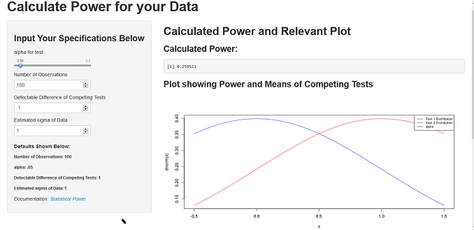

## Statistical Power App
 
- Use this app if you want to calculate the power of your experiment.
- You can also use this app to get a ballpark estimate of how many observations         you need to take, given a preferred statistical power, alpha, and estimated sigma.


--- .class #id 

## Step 1: Input your data

1. Number of Observations
2. alpha 
3. sigma (this is the population standard deviation) 
4. Estimated Detectable difference (in means of 2 Competing Hypotheses)

## Output on Main Panel
- Calculated Power
- A plot showing the distributions of the two hypotheses and a line marking alpha
- Your input parameters


--- .class #id
### Demo Inputs and Demo App Screen:

1. Number of Observations: 100
2. alpha : .05
3. sigma : 1 
4. Estimated Detectable difference : .1

```{r, echo=FALSE}
library(graphics)
library(png)
img=readPNG("screenshot2.png")
grid::grid.raster(img)
```


--- .class #id 

## Some R code Behind the App 

```{r, message = FALSE, warnings = FALSE}
output_power=function(alpha,factor){
        power=1-pnorm(qnorm(1-alpha)-factor)
        return(power)
}

alpha=.05
delta_mu=.1
sigma=1
n_observations=100
factor=delta_mu/(sigma/sqrt(n_observations))
power=output_power(alpha,factor)

y=delta_mu/(sigma/sqrt(n_observations))
x=seq(-abs(y)*.5,abs(y)*1.5,length.out=100)

```
### Power:

`r output_power(alpha,factor)`

```{r, echo=FALSE, message = FALSE, warnings = FALSE}

                invisible(plot(x,dnorm(x),type="ln", col="blue"))
                invisible(lines(x,dnorm(x,mean=y), col="red"))
                invisible(lines(rep(qnorm(1-alpha),2),c(0,.5)))
                invisible(legend('topright',legend=c("Test 1 Distribution", "Test 2 Distribution", "alpha"), col=c("blue","red","black"),lty=1,cex=.75))
```
Hope you enjoy this application.

###


